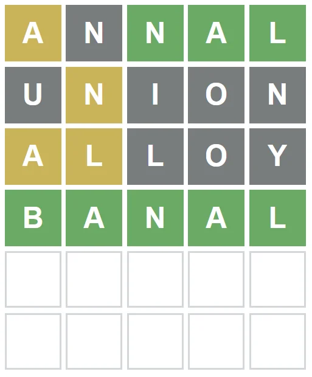

## Rules governing repeated letters in Wordle

## 1. A particular letter (e.g. 'N') will only 'light up' (be colored green or yellow) as many times as it is in the word.

Yesterday's word was BANAL, which only contains one 'N' and one 'L'. So in my guesses of ANNAL, UNION and ALLOY only one 'N' or 'L' lights up.

By contrast, BANAL contains two As, and both As in ANNAL light up.

## 2. If you repeat a letter more times than it is contained in the word, and one of the repeated letters is in the correct position, that letter will always light up in green.

In ANNAL the 'N' in slot 3 is in the right position, so it is lit up in green.

## 3. If you repeat a letter more times than it is contained in the word, but none of the repeated letters is in the correct position, the first letter will light up in yellow.

In UNION, neither N is in the correct position. So the 'N' in slot 2 gets lit up in yellow. This implicitly also tells you that the N is not in position 5 - otherwise, that N would have lit up in green instead.

Similarly, none of the Ls in ALLOY are in the right position, so the L in slot 2 lights up - but this implicitly tells you that slot 3 is not right for the L either.

https://www.reddit.com/r/wordle/comments/ry49ne/illustration_of_what_happens_when_your_guess_has/
